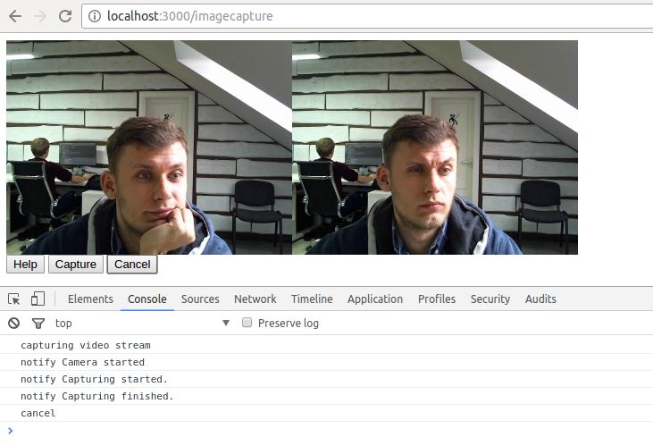

# ng2-webcam

> ng2-webcam is a cross-browser angular2 component, it will use the browser's native `getUserMedia()` implementation, otherwise a Flash fallback will be loaded instead.

## Screenshot



## Notes

This component based on [getUserMedia.js Polyfill](https://github.com/addyosmani/getUserMedia.js).
Pls, check original repository for clear understanding


## Getting Started

```
npm install ng2-webcam --save
```

Use webcam as a pure angular2 component

1. Add component into your module
```javascript
import { WebCamComponent } from 'ng2-webcam';
...

@NgModule({
  imports: [
    BrowserModule,
    HttpModule,
    AppRouting
  ],
  declarations: [
    AppComponent,
    WebCamComponent
  ],
  bootstrap: [ AppComponent ]
})
class AppModule {
}
export default AppModule;
```
2. Use in html markup
```html
<ng2-webcam [options]="options" [onSuccess]="onSuccess" [onError]="onError"></ng2-webcam>
```

Below is a sample of options structure

```javascript
cont options = {
  audio: false,
  video: true,
  width: 500,
  height: 500
};
const onSuccess = () => {};
const onError = (err) => {};
```

Also You can extend flash fallback params

```javascript
cont options = {
  audio: false,
  video: true,
  width: 500,
  height: 500,
  fallbackMode: 'callback',
  fallbackSrc: '/node_modules/ng2-webcam/lib/fallback/jscam_canvas_only.swf',
  fallbackQuality: 85
};
const onSuccess = () => {};
const onError = (err) => {};
```


## [Credits](https://github.com/addyosmani/getUserMedia.js#credits)

## Spec references

* [getUserMedia()](https://w3c.github.io/mediacapture-main/getusermedia.html)
* [WebRTC 1.0](http://w3c.github.io/webrtc-pc/)

## License
Copyright (c) 2016 archik
Licensed under the MIT license.
